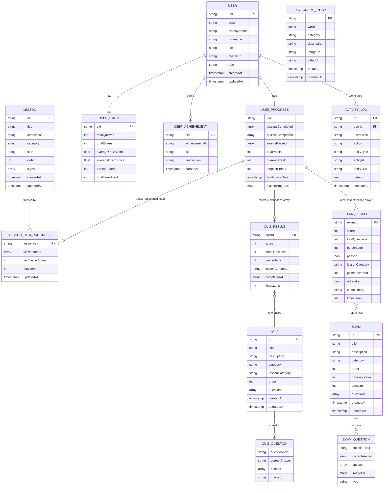

# Signtify — Entity Relationship Diagram

## Firestore Collections Overview

Signtify uses **Firebase Firestore** (NoSQL document database). The data is organized into the following top-level collections:

```
Firestore
├── users/          ← User profiles, progress, stats, achievements
├── lessons/        ← Admin-managed lesson content (Firestore-based lessons)
├── quizzes/        ← Admin-managed quiz content
├── exams/          ← Admin-managed proficiency exam content
├── dictionary/     ← Sign language dictionary entries
└── activityLogs/   ← Audit trail of user actions
```

---

## Entity Relationship Diagram



---

## Hardcoded Lesson Categories (React Components)

These lessons are **not stored in Firestore** — they are built directly into the React components. Their progress IS tracked in Firestore under `users/{uid}/progress/lessonProgress`.

| Lesson | Route | Signs | Component |
|---|---|---|---|
| Alphabet | `/lessons/alphabet` | 26 (A–Z) | `LessonAlphabet.jsx` |
| Greetings | `/lessons/greetings` | 12 | `LessonGreetings.jsx` |
| Numbers | `/lessons/numbers` | 10 (1–10) | `LessonNumbers.jsx` |
| Daily Conversation | `/lessons/daily-conversation` | 9 | `LessonDailyConversation.jsx` |

**Lesson unlock sequence:**
```
Alphabet (26) → Greetings (12) → Numbers (10) → Daily Conversation (9)
```

---

## User Document Structure (Firestore)

```json
{
  "uid": "abc123",
  "email": "user@example.com",
  "displayName": "Juan",
  "nickname": "",
  "bio": "",
  "avatarUrl": "",
  "role": "user",
  "createdAt": "Timestamp",
  "updatedAt": "Timestamp",

  "progress": {
    "lessonsCompleted": ["lesson_abc", "lesson_xyz"],
    "totalPoints": 250,
    "currentStreak": 3,
    "longestStreak": 7,
    "lastActivityDate": "2026-02-27",

    "lessonProgress": {
      "lesson_alphabet": {
        "viewedItems": ["A", "B", "C"],
        "lastViewedIndex": 2,
        "totalItems": 26,
        "updatedAt": "Timestamp"
      },
      "lesson_greetings": {
        "viewedItems": ["Hello", "Goodbye"],
        "lastViewedIndex": 1,
        "totalItems": 12,
        "updatedAt": "Timestamp"
      }
    },

    "quizzesCompleted": [
      {
        "quizId": "quiz_abc",
        "score": 4,
        "totalQuestions": 5,
        "percentage": 80,
        "lessonCategory": "alphabet",
        "completedAt": "2026-02-27T10:00:00.000Z",
        "timestamp": 1740650400000
      }
    ],

    "examsPassed": [
      {
        "examId": "exam_abc",
        "score": 16,
        "totalQuestions": 20,
        "percentage": 80,
        "passed": true,
        "lessonCategory": "alphabet",
        "pointsAwarded": 320,
        "isRetake": false,
        "completedAt": "2026-02-27T11:00:00.000Z",
        "timestamp": 1740654000000
      }
    ]
  },

  "stats": {
    "totalQuizzes": 5,
    "totalExams": 2,
    "averageQuizScore": 78,
    "averageExamScore": 82,
    "perfectScores": 1,
    "totalTimeSpent": 0
  },

  "achievements": [
    {
      "achievementId": "first_quiz",
      "title": "First Quiz",
      "description": "Completed your first quiz",
      "earnedAt": "Timestamp"
    }
  ]
}
```

---

## Exam Document Structure (Firestore `exams` collection)

```json
{
  "id": "exam_abc",
  "title": "Proficiency Exam 1",
  "description": "Test your ASL knowledge",
  "category": "alphabet",
  "order": 1,
  "passingScore": 80,
  "timeLimit": 20,
  "questions": [
    {
      "question": "What letter is this sign?",
      "answer": "A",
      "options": ["A", "B", "C", "D"],
      "imageUrl": ""
    }
  ],
  "createdAt": "Timestamp",
  "updatedAt": "Timestamp"
}
```

---

## Quiz Document Structure (Firestore `quizzes` collection)

```json
{
  "id": "quiz_abc",
  "title": "Alphabet Quiz",
  "description": "Test your alphabet knowledge",
  "category": "alphabet",
  "lessonCategory": "alphabet",
  "order": 1,
  "questions": [
    {
      "question": "What letter is this sign?",
      "answer": "A",
      "options": ["A", "B", "C", "D"]
    }
  ],
  "createdAt": "Timestamp",
  "updatedAt": "Timestamp"
}
```

---

## Activity Log Document Structure (Firestore `activityLogs` collection)

```json
{
  "id": "log_abc",
  "userId": "abc123",
  "userEmail": "user@example.com",
  "action": "quiz_taken",
  "entityType": "quiz",
  "entityId": "quiz_abc",
  "entityTitle": "Alphabet Quiz",
  "details": {
    "score": 4,
    "totalQuestions": 5,
    "percentage": 80,
    "lessonCategory": "alphabet"
  },
  "timestamp": "Timestamp"
}
```
