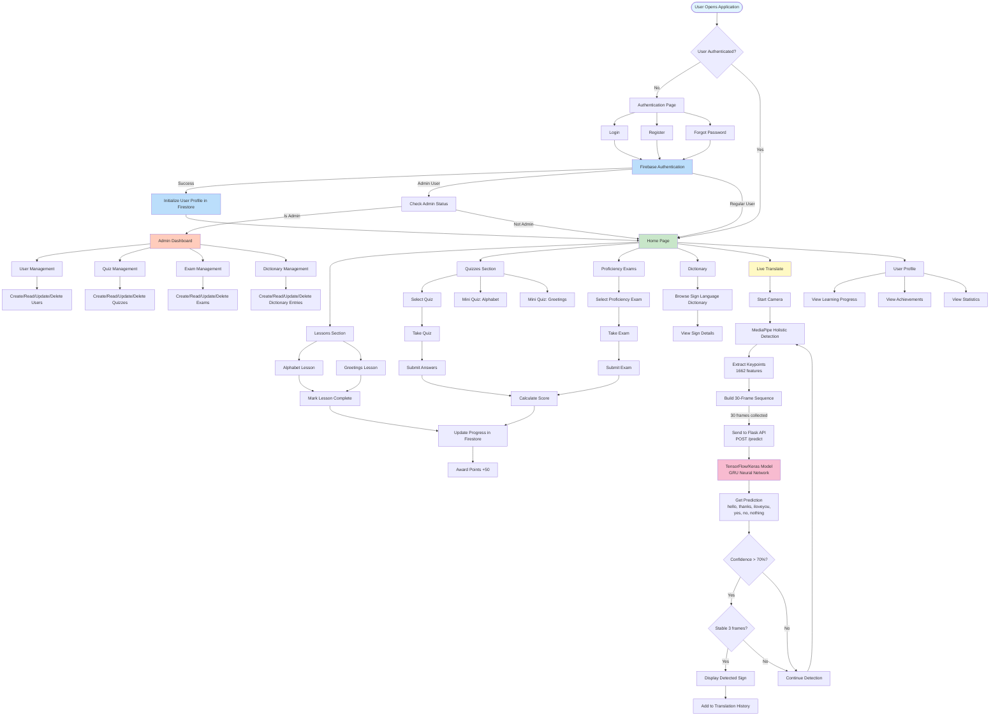
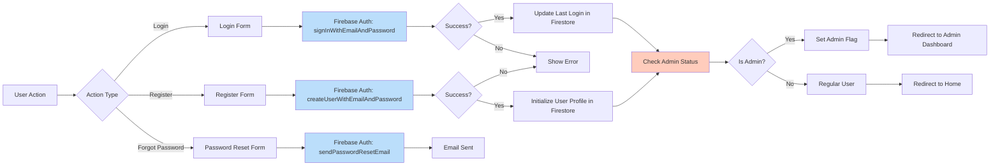
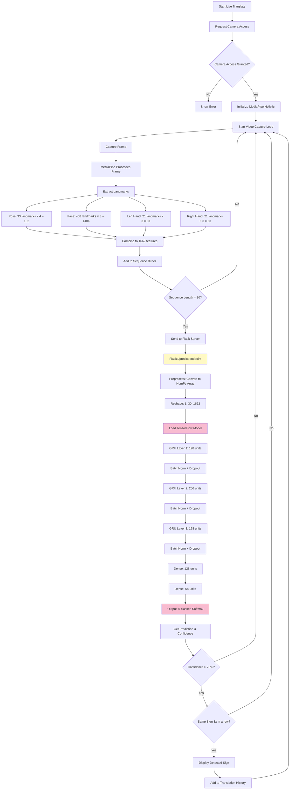
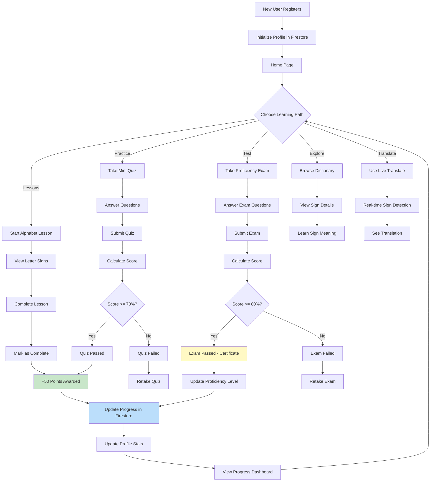
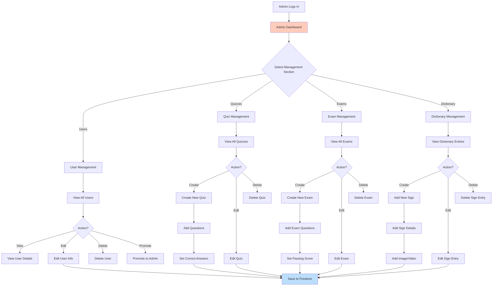
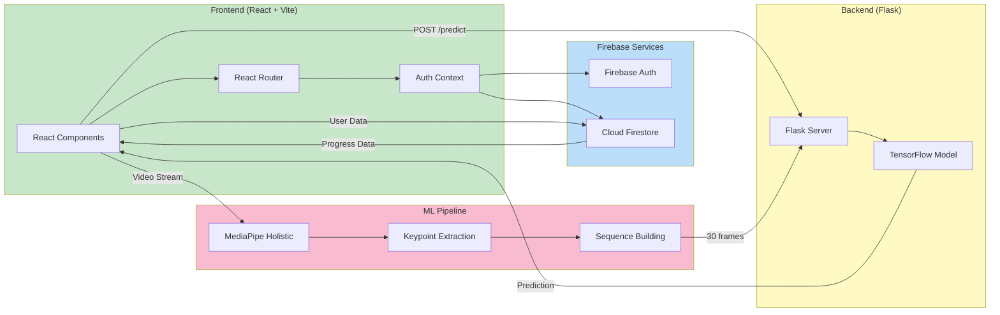

# Signtify Project Flowchart

## System Architecture Flowchart

## Authentication Flow

## Live Translation ML Pipeline

## User Learning Journey

## Admin Management Flow

## Data Flow Architecture

## Technology Stack

- **Frontend**: React 19, React Router, Vite
- **Backend**: Flask (Python)
- **ML Framework**: TensorFlow/Keras
- **Computer Vision**: MediaPipe Holistic
- **Authentication**: Firebase Auth
- **Database**: Cloud Firestore
- **Styling**: CSS with animations (GSAP)

## Key Features

1. **User Authentication**: Login, Register, Password Reset, Google Sign-In
2. **Lessons**: Interactive alphabet and greetings lessons
3. **Quizzes**: Mini quizzes and full quizzes with scoring
4. **Proficiency Exams**: Certification exams with passing scores
5. **Dictionary**: Browse sign language dictionary
6. **Live Translation**: Real-time sign language detection using ML model
7. **Progress Tracking**: Points, achievements, and learning statistics
8. **Admin Dashboard**: User, quiz, exam, and dictionary management

